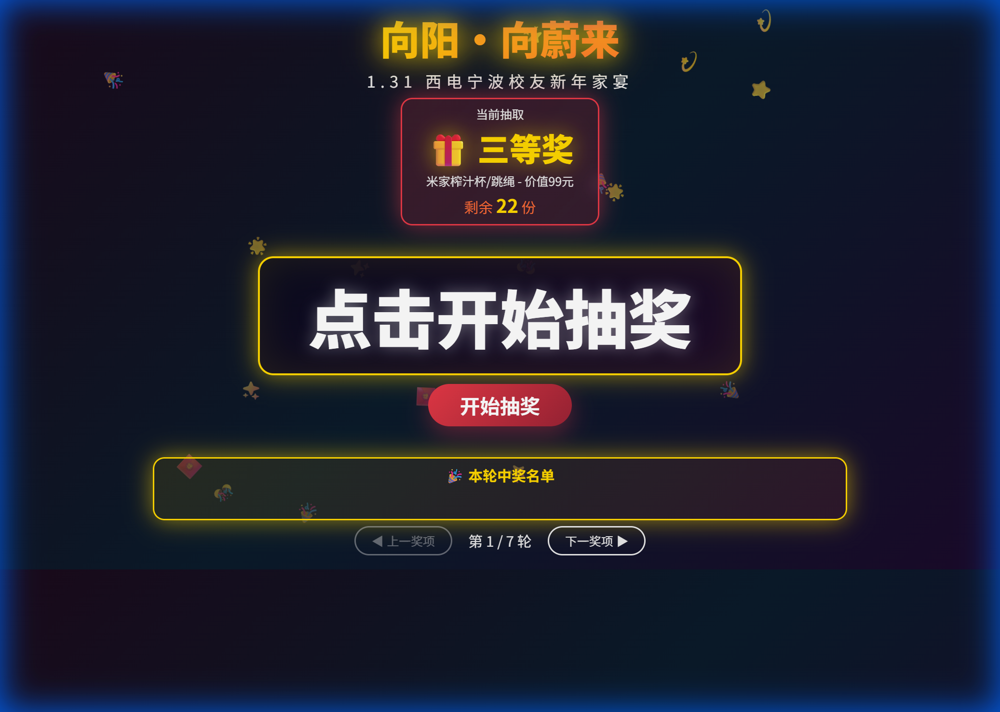

# lottery_for_ningboalumni_xidian (西电宁波校友新年家宴抽奖系统)

这是一个为西电宁波校友会新年家宴定制的现场抽奖系统。采用纯前端技术栈（HTML/CSS/JS）开发，旨在提供流畅、炫酷的视觉体验，烘托活动现场氛围。


## 📸 界面预览




## ✨ 特性

*   **炫酷视觉效果**：深色霓虹主题，配合粒子烟花特效与辉光动画，适配大屏幕展示。
*   **流畅交互**：支持多轮抽奖、名单快速滚动去重、奖项自动切换。
*   **纯静态部署**：无需后端服务器，双击 `index.html` 即可运行，即使断网也能使用。
*   **可配置化**：通过代码轻松配置参与名单与奖项设置。

## 🚀 快速开始

1.  **下载/克隆项目**
    ```bash
    git clone https://github.com/edisoncccc/lottery_for_ningboalumni_xidian.git
    ```
2.  **准备数据**
    *   修改 `script.js` 中的 `attendants` 数组，填入参与抽奖的人员名单。
    *   修改 `cfg` 对象中的 `prizes` 数组，设置奖项名称、数量及描述。
3.  **运行**
    *   直接在浏览器中打开 `index.html` 文件。
    *   推荐按下 `F11` 开启全屏模式以获得最佳体验。

## 🛠️ 技术栈

*   **HTML5**: 语义化结构
*   **CSS3**: Flexbox布局, CSS Animations, 霓虹光效
*   **JavaScript (ES6+)**: 核心逻辑, DOM操作, Canvas烟花动画

## 📂 目录结构

```
.
├── index.html          # 主页面
├── style.css           # 样式文件 (包含所有动画与主题可视效果)
├── script.js           # 业务逻辑 (名单、抽奖算法、事件处理)
├── bgm.mp3             # 背景音乐 (可选)
└── PRD/                # 产品需求文档与说明
```

## 📝 许可证

本项目采用 [MIT License](LICENSE) 开源。

---
*Designed for 2025-2026 西电宁波校友会年会*
